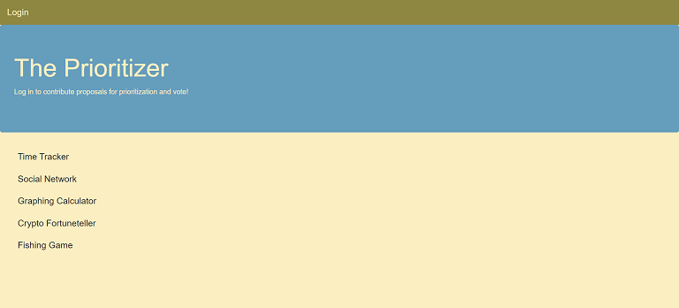
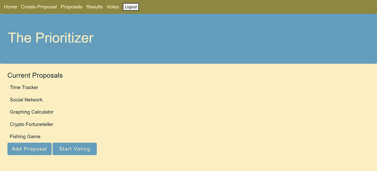

# Prioritizer 

A remote hosted application that allows distributed teams a way to submit ideas and vote on which should be prioritized.

# Description

The Prioritizer provides a way for teams (especially remote teams) to prioritize product feature ideas when there are more proposals than resources available to implement them.

The application allows users to list proposed features for consideration and then allows team members to vote on the proposals they like. It will then list the proposals, by which ones received the most votes.

## Table of Contents

- [Screenshots](#screenshots)
- [Links](#links)
- [User Story](#user)
- [Technologies Used](#technologies)
- [Acceptance Criteria](#acceptance)
- [Development Team](#team)
- [License](#license)

# Screenshots

# Links

The code is on [GitHub Repository](https://github.com/mdschenck/Prioritizer)

The application is live on [Heroku](https://infinite-coast-94356.herokuapp.com/)

# User

- As a product manager, I have too many ideas to implement with limited resources to get them accomplished.

- I want the ability for a group of people to be able to vote on ideas as a way to prioritize them.

- As a user, I want the ability to be able to submit Ideas to be on a list for prioritization.

- As a user, I want the ability to vote on ideas I like so that my vote will help prioritize the idea.

- As a user, I want the ability to have multiple votes (with a limit) so I can add multiple votes to give an idea a higher priority.

- As a user, I want to know the time limit on how much time is left to vote.

- As a user, I want to see a final prioritized list of ideas ranked in order of which idea got the most votes.

# Technologies 

- Node.js
- Express.js
- MySQL
- Handlebars
- Chart.js
- Heroku

# Acceptance

The following acceptance criteria were met for the project:

- [x] Use of Node.js and Express.js to create a RESTful API.
- [x] Use of Handlebars.js as the template engine.
- [x] Use MySQL and the Sequelize ORM for the database.
- [x] Has both GET and POST routes for retrieving and adding new data.
- [x] Uses at least one new library, package, or technology that we haven’t discussed.
- [x] Has a folder structure that meets the MVC paradigm.
- [x] Includes authentication (express-session and cookies).
- [x] Protects API keys and sensitive information with environment variables.
- [x] Is deployed using Heroku (with data).
- [x] Has a polished UI.
- [x] Is responsive.
- [x] Is interactive (i.e., accepts and responds to user input).
- [x] Meets good-quality coding standards (file structure, naming conventions, follows best practices for class/id naming conventions, indentation, quality comments, etc.).
- [x] Has a professional README (with unique name, description, technologies used, screenshot, and link to deployed application).

# Team

The following team members contributed to this application:
- Andres Sierra
- Michael Schenck
- Misty Duhart
- Stephen Currie

# License

MIT License https://opensource.org/licenses/MIT
